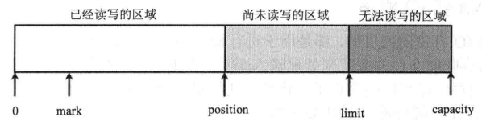
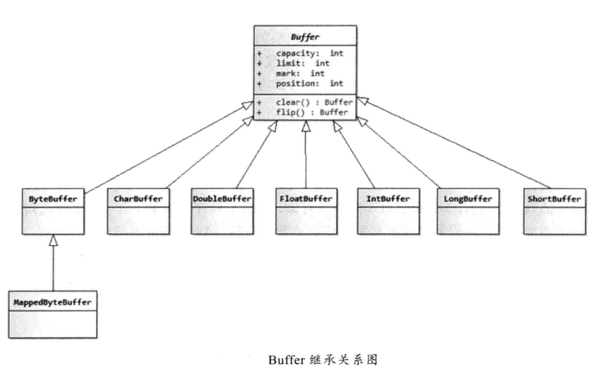
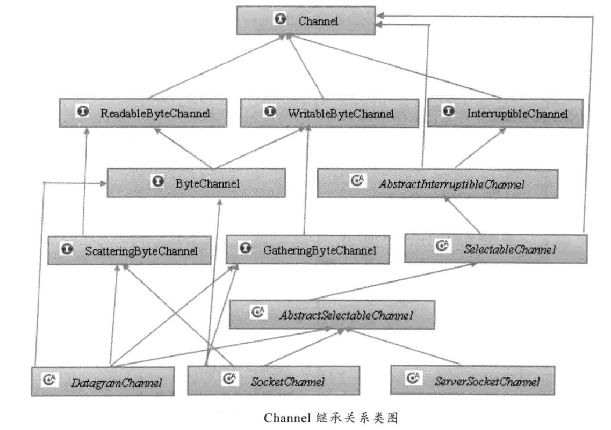

# 输入/输出
## Nio
### Buffer

#### 概述

**Java Nio 的核心类库多路复用器Selector是基于epoll的多路复用技术实现。**
Buffer像一个数组，它可以保存多个类型相同的数据。Buffer是一个抽象类，其最常用的子类是ByteBuffer，它可以在底层字节数组上进行get/set操作。除了ButeBuffer之外，对应于其他基本数据类型（boolean除外）都有对应的Buffer类：```CharBuffer```、```ShortBuffer```、```IntBuffer```、```LongBuffer```、```FloatBuffer```、```DoubleBuffer```;

上面这些Buffer类，除了ByteBuffer之外，它们都采用相同或相似的方法来管理数据;

#### 创建

```static XxxBuffer allocate(int capacity)```
	创建一个容量为capacity的XxxBuffer对象;
	
#### Buffer中重要概念
- **容量(capacity)**
	<br/>缓冲区的容量表示该Buffer的最大数据容量。不可能为负值，创建后不能改变。
- **界限(limit)**
	<br/>第一个不应该被读出或者写入的缓冲区位置索引。位于limit后(包括limit位置)的数据不可以被读写。
- **位置(position)**
	<br/>下一个可以被读或写的缓冲区位置索引。初始值为0(第一个位置的索引)。
- **标记(mark)**
	<br/>类似于传统IO流中的mark，Buffer可以直接将position定位到mark处。


	
> 上述值满足如下关系<br/>
```0 <= mark <= position <= limit <= capacity```

	
#### put()/get()
put()和get()方法，用于向Buffer中放入/取出数据，Buffer支持单个数据访问和批量数据访问（以数组为参数）;

- 相对（Relative）：从Buffer的当前position处开始读取或写入数据，然后将position按处理元素个数增加；
- 绝对（Absolute）：直接根据索引处理数据就，position不会被影响；

#### 其他常用方法
- ```int capacity()```返回capacity大小;
- ```int limit()```返回limit位置;
- ```int position()```返回position位置;
- ```Buffer limit(int newLt)```重新设置limit值，返回具有新limit的Buffer对象;
- ```Buffer position(int newPs)```重新设置position，返回position被修改的Buffer对象;
- ```Buffer mark()```设置标记，标记位置为当前position位置;
- ```boolean hasRemaining()```position和limit之间是否有可处理元素;
- ```int remaining()```position和limit之间元素个数;
- ```Buffer reset()```设置position为mark;
- ```Buffer rewind()```设置position=0，mark会被取消;
- ```Buffer flip()```设置limit = position，封印position和capacity之间的区域;
- ```clear()```将position设为0，为下一次读取数据做准备

#### Buffer继承关系类图


***
### Channel
Channel类似于传统的流对象，但Channel中的数据不可以直接访问，必须通过Buffer与Channel交互。
#### 创建
Channel应该通过传统的InputStream、OutputStream对象的getChannel()方法获取。
#### 方法
- ```MappedByteBuffer map(MapMode mode,long position, long size)```
Channel映射成Buffer，参数：映射模式（只读、读写等）、起始位置、映射长度
##### 例子
```
public void test1() throws IOException {
		File f = new File("/home/houzw/Documents/temp/test.txt");
		
		FileChannel inChannel = new FileInputStream(f).getChannel();
		MappedByteBuffer buffer = inChannel.map(MapMode.READ_ONLY, 0, inChannel.size());

		Charset charset = Charset.forName("GBK");
		CharsetDecoder decoder = charset.newDecoder();
		CharBuffer charbuffer = decoder.decode(buffer);
		
		System.out.println(charbuffer);
	}
```
- ```int read(ByteBuffer dst)```
读取Channel内容到Buffer dst中，dst作为竹筒多次取Channel中的水
##### 例子
```
	public  void test2() throws IOException {
		File f = new File("/home/houzw/Documents/temp/test.txt");
		CharsetDecoder decoder = Charset.forName("GBK").newDecoder();
	
		FileChannel inChannel = new FileInputStream(f).getChannel();
		ByteBuffer buffer = ByteBuffer.allocate(5);
		
		while (inChannel.read(buffer) != -1) {
			buffer.flip();
			CharBuffer cbuffer = decoder.decode(buffer);
			System.out.print(cbuffer);
			buffer.clear();
		}
	}
```
#### Channel 继承关系类图


***
### Selector 多路复用器
Selector是Java NIO核心组件中的一个，用于检查一个或多个NIO Channel（通道）的状态是否处于可读、可写。如此可以实现单线程管理多个channels,也就是可以管理多个网络链接。
#### Selector的创建
```Selector selector = Selector.open();```

#### 注册Channel到Selector
```
channel.configureBlocking(false);
SelectionKey key = channel.register(selector, Selectionkey.OP_READ);
```
**Channel必须是非阻塞的。**
所以FileChannel不适用Selector，因为FileChannel不能切换为非阻塞模式，更准确的来说是因为FileChannel没有继承SelectableChannel。Socket channel可以正常使用。

- ```abstract SelectableChannel configureBlocking(boolean block) ```
	用于使通道处于阻塞模式或非阻塞模式
	
#### register()
```SelectionKey register(Selector sel, int ops)```
register() 方法的第二个参数。这是一个“ interest集合 ”，意思是在通过Selector监听Channel时对什么事件感兴趣。可以监听四种不同类型的事件：
`Connect` 连接就绪
`Accept` 接收就绪
`Read` 读就绪 
`Write`写就绪
通道触发了一个事件意思是该事件已经就绪。比如某个Channel成功连接到另一个服务器称为“ 连接就绪 ”。一个Server Socket Channel准备好接收新进入的连接称为“ 接收就绪 ”。一个有数据可读的通道可以说是“ 读就绪 ”。等待写数据的通道可以说是“ 写就绪 ”。

这四种事件用SelectionKey的四个常量来表示：
```
SelectionKey.OP_CONNECT
SelectionKey.OP_ACCEPT
SelectionKey.OP_READ
SelectionKey.OP_WRITE
```
如果你对不止一种事件感兴趣，使用或运算符即可，如下：
```int interestSet = SelectionKey.OP_READ | SelectionKey.OP_WRITE;```
	
	
	
	
	
	
	
	
	
	
	
	
	
	
	
	
	
	
	
	

