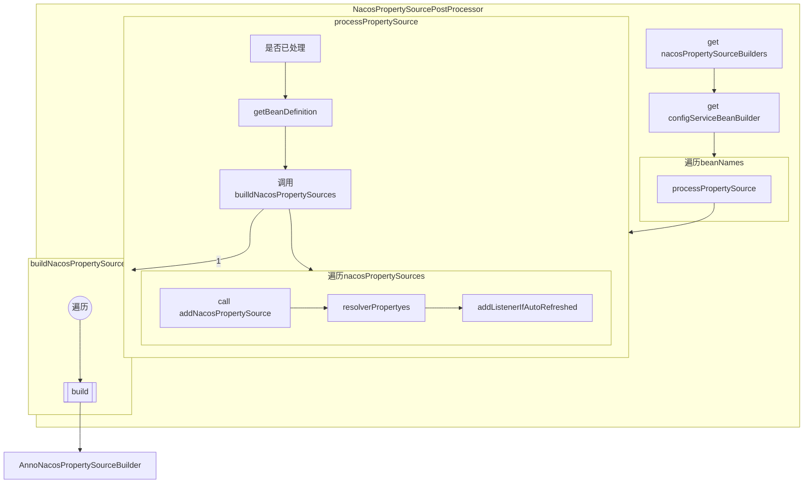

```mermaid
graph TD

subgraph NacosPropertySourcePostProcessor
    getnpsb[get nacosPropertySourceBuilders]
    getcsbb[get configServiceBeanBuilder]


    subgraph rangBeanNames1[遍历beanNames]
        processPropertySource
    end
    subgraph pps[processPropertySource]
        pps1[是否已处理] -->
        pps2[getBeanDefinition]-->
        pps3[调用builldNacosPropertySources]
        pps3 --> pps4
        subgraph pps4[遍历nacosPropertySources]
            pps5[call addNacosPropertySource] -->
            pps6[resolverPropertyes] -->
            pps7[addListenerIfAutoRefreshed]
        end
    end
    pps3 --> |1|buildNacosPropertySources

    subgraph buildNacosPropertySources
        rnpsb1((遍历)) -->
        npsb2[[build]]
    end

    getnpsb --> getcsbb --> rangBeanNames1
    processPropertySource --> pps
end

npsb2 --> AnnoNacosPropertySourceBuilder


```
```
graph TD
flowchart LR

        subgraph 遍历执行nacosPropertySourceBuilders
            A(1) --> B[2] --> C((3)) --> D[[4]]
        end
```